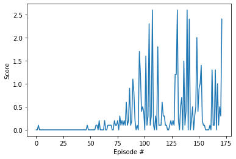

# Dependencies

This is an amended version of the `python/` folder from the [ML-Agents repository](https://github.com/Unity-Technologies/ml-agents).  It has been edited to include a few additional pip packages needed for the Deep Reinforcement Learning Nanodegree program.


# Project Details

### Unity ML-Agents Tennis Environment


In this environment, two agents control rackets to bounce a ball over a net. If an agent hits the ball over the net, it receives a reward of +0.1. If an agent lets a ball hit the ground or hits the ball out of bounds, it receives a reward of -0.01. Thus, the goal of each agent is to keep the ball in play.

The observation space consists of 8 variables corresponding to the position and velocity of the ball and racket. Each agent receives its own, local observation. Two continuous actions are available, corresponding to movement toward (or away from) the net, and jumping.

The task is episodic, and in order to solve the environment, your agents must get an average score of +0.5 (over 100 consecutive episodes, after taking the maximum over both agents). Specifically,

- After each episode, we add up the rewards that each agent received (without discounting), to get a score for each agent. This yields 2 (potentially different) scores. We then take the maximum of these 2 scores.
- This yields a single score for each episode.

The environment is considered solved, when the average (over 100 episodes) of those scores is at least +0.5.


# Getting Started

### Step 1: Activate the Environment

To set up your python environment to run the code in this repository, follow the instructions below.

1. Create (and activate) a new environment with Python 3.6 in **Anaconda Prompt**.

    - __Linux__ or __Mac__: 
    ```bash
    conda create --name drlnd python=3.6
    source activate drlnd
    ```
    - __Windows__: 
    ```bash
    conda create --name drlnd python=3.6 
    activate drlnd
    ```
    
2. If running in **Windows**, ensure you have the "Build Tools for Visual Studio" installed from this [site](https://visualstudio.microsoft.com/downloads/).  This [article](https://towardsdatascience.com/how-to-install-openai-gym-in-a-windows-environment-338969e24d30) may also be very helpful.

3. Follow the instructions in [this repository](https://github.com/openai/gym) or `pip install gym` to perform a minimal install of OpenAI gym.
   - Install the **classic control** environment group by following the instructions [here](https://github.com/openai/gym#classic-control) or `pip install gym[classic_control]`.
   - Install the **box2d** environment group by following the instructions [here](https://github.com/openai/gym#box2d) or `pip install gym[box2d]`.
     If any failed or error to install box2d environment,  following:
     ```bash
     pip install swig
     pip install Box2D gym
     ```
     **OR**
     ```bash
     conda install swig
     conda install -c conda-forge gym-box2d
     ```
    
4. Clone the repository, and navigate to the folder.  Then, install several dependencies.  
    ```bash
    git clone https://github.com/TheOnlyMiki/Udacity-Deep-Reinforcement-Learning-Nanodegree-Program.git
    cd Udacity-Deep-Reinforcement-Learning-Nanodegree-Program
    pip install .
    ```

5. Create an [IPython kernel](http://ipython.readthedocs.io/en/stable/install/kernel_install.html) for the `drlnd` environment.    
    ```bash
    python -m ipykernel install --user --name drlnd --display-name "drlnd"
    ```

6. Before running code in a notebook, change the kernel to match the `drlnd` environment by using the drop-down `Kernel` menu. 


(For Windows users) The ML-Agents toolkit supports Windows 10. While it might be possible to run the ML-Agents toolkit using other versions of Windows, it has not been tested on other versions. Furthermore, the ML-Agents toolkit has not been tested on a Windows VM such as Bootcamp or Parallels.


### Step 2: Download the Unity Environment

For this project, you will not need to install Unity - this is because we have already built the environment for you, and you can download it from one of the links below. You need only select the environment that matches your operating system:

<ul role="list" class="css-19qh3zo"><li class="css-cvpopp">Linux: <a target="_blank" rel="noopener noreferrer" class="chakra-link css-190botj" href="https://s3-us-west-1.amazonaws.com/udacity-drlnd/P3/Tennis/Tennis_Linux.zip">click here</a></li><li class="css-cvpopp">Mac OSX: <a target="_blank" rel="noopener noreferrer" class="chakra-link css-190botj" href="https://s3-us-west-1.amazonaws.com/udacity-drlnd/P3/Tennis/Tennis.app.zip">click here</a></li><li class="css-cvpopp">Windows (32-bit): <a target="_blank" rel="noopener noreferrer" class="chakra-link css-190botj" href="https://s3-us-west-1.amazonaws.com/udacity-drlnd/P3/Tennis/Tennis_Windows_x86.zip">click here</a></li><li class="css-cvpopp">Windows (64-bit): <a target="_blank" rel="noopener noreferrer" class="chakra-link css-190botj" href="https://s3-us-west-1.amazonaws.com/udacity-drlnd/P3/Tennis/Tennis_Windows_x86_64.zip">click here</a></li></ul>

### Step 3: Explore the Environment

After you have followed the instructions above, open `Tennis.ipynb` (located in the folder in the course 4 GitHub repository) and follow the instructions to learn how to use the Python API to control the agent.

# Report

### Training Code

- `Tennis.ipynb`
- `model.py`
- `ddpg_agent.py`

### Saved Model Weights

- `checkpoint_actor.pth` - Actor Network
- `checkpoint_critic.pth` - Critic Network

### Learning Algorithm

#### - Hyperparameters:
```
- BUFFER_SIZE = int(1e5) # replay buffer size
- BATCH_SIZE = 256    # minibatch size
- GAMMA = 0.99      # discount factor
- TAU = 0.1      # for soft update of target parameters
- LR_ACTOR = 0.001    # learning rate of the actor
- LR_CRITIC = 0.001   # learning rate of the critic
```

#### - Actor Network - Estimate the Optimal Action

- Deep Deterministic Policy Gradient:
    
    ```
    1. Fully Connected Layer with ReLu Activation Function = 24 -> 64
    2. Fully Connected Layer with ReLu Activation Function = 64 -> 64
    3. Fully Connected Layer with Hyperbolic Tangent = 64 -> 2
    ```

#### Critic Network - Evaluate the Value of Optimal Action

- Deep Deterministic Policy Gradient:
    
    ```
    1. Fully Connected Layer with ReLu Activation Function = 24 -> 64
    2. Concatnate the Actions and Output from Previous Layer = 64 + Actions
    3. Fully Connected Layer with ReLu Activation Function = 64 + Actions -> 128
    4. Fully Connected Layer = 128 -> 1
    ```

### Plot of Rewards

The agents must get an average score of +0.5 (over 100 consecutive episodes, after taking the maximum over both agents).

- `DDPG.png` - Episode 172, Average Score: 0.50, Environment solved in 72 episodes.


